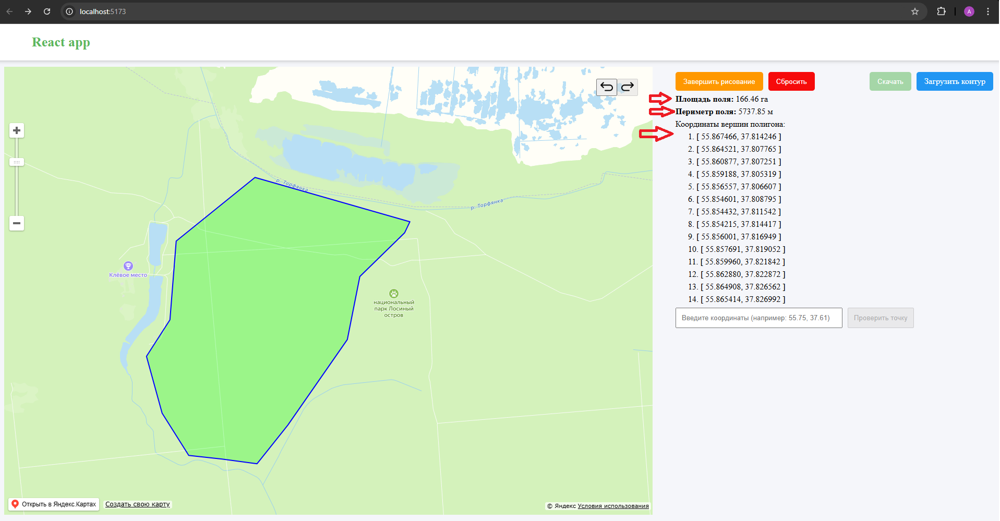
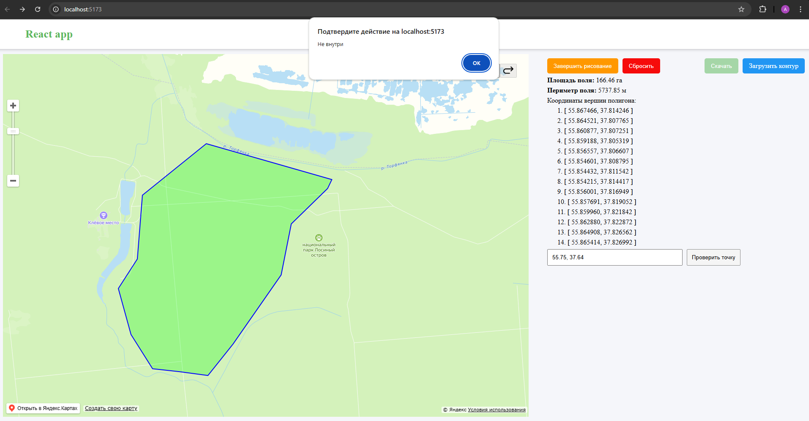

# Веб-приложение для обозначения границ поля на карте (React + TypeScript + Vite)


## Инструкция по запуску

Для запуска проекта необходима одна из следующих версий Node.js:
- **Node.js**: `^18.18.0`, `^20.9.0` или `>=21.1.0`

1. Установите зависимости с помощью ```npm install```
2. Запустите проект с помощью ```npm run dev```
3. Откройте приложение в браузере http://localhost:5173/

## Инструкция по использованию

1. Загрузить ранее сохранённый контур с помощью кнопки `Загрузить контур` или перейти в режим рисования с помощью кнопки `Начать рисование` и нарисовать контур 
 
2. После завершения контура отобразится следующая информация:
    - Площадь поля в гектарах;
    - Периметр поля в метрах;
    - Координаты вершин полигона;

   А также станет доступна кнопка `Скачать`, чтобы сохранить полигон, и поле ввода, куда можно ввести координаты, а в
      ответ появится диалоговое окно, находится ли точка внутри полигона или вне.
      